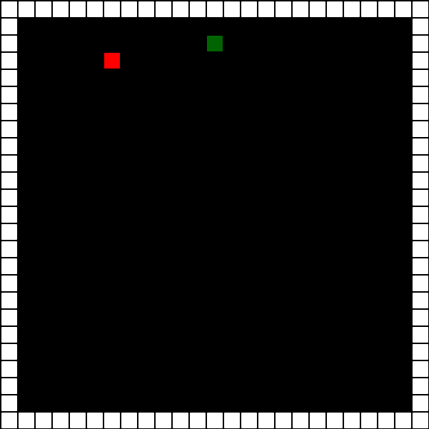

# Welcome to Multisnake
### What is multisnake?
You know snake?

that is snake

Gamplay is super simple. You use the arrow keys or WASD to move your snake. You try and go eat the apples, and every time you eat the apples your snakes length increases by 1. Usually, you win the game when your length exceeds or matches a certain number. You lose the game when you run into yourself or the wall. Sounds simple? Its not. Becuase your length increases every time you eat an apple, it gets harder and harder to avoid your self. 
#### and thats how you play snake
***

### But what is multisnake?

#### Multisnake:

I know, I know, this looks like a lamified version of google snake. 

Spoiler alert: it kind of is.

But, this game has 2 major differences to normal snake:

1. Using the space bar gives you a boost (boosting costs apples)
2. You play with multiple people

#### But how does this work?

The goal of the game is to get to a score of 50. But, if another snake runs into you, you die. Seems simple? It kind of is. Use your boost wisely to kill other snakes that are close to winning.
Add pull requests if you have ideas for seperate rooms (Working on that currently), or if you have an implementation of a chat (ENTER to chat, for example).

If you just came here because you looked up multisnake and this popped up, dont worry, play the game [here](https://multisnake.sojs.dev)

## Submitting Issues

Just submit them. Or, save me some time :smile:, and create a pull request with the issue already fixed.
